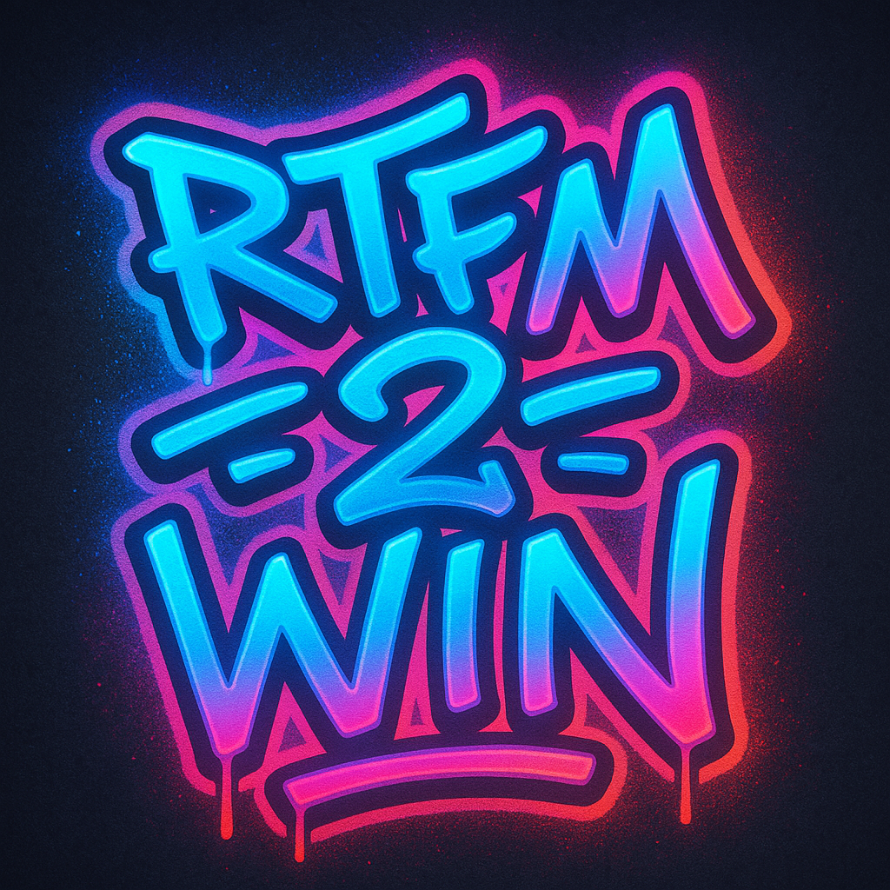

<div align="center">
  
  
  # 🎯 RTFM2WIN
  
  ### Plateforme Interactive de Quiz et d'Apprentissage
  
  *Créez, jouez et apprenez avec des quiz interactifs en temps réel*
  
  [](https://laravel.com)
  [](https://reactjs.org)
  [](https://www.typescriptlang.org)
  [](https://php.net)
  [](https://tailwindcss.com)
  [](https://mysql.com)
  
  [](https://opensource.org/licenses/MIT)
  [](http://makeapullrequest.com)
  [](https://github.com/votre-username/rtfm2win/graphs/commit-activity)
  
</div>

---

## 📖 **À Propos**

**RTFM2WIN** est une plateforme moderne et interactive de quiz conçue pour révolutionner l'apprentissage et l'évaluation. Développée avec les dernières technologies web, elle offre une expérience utilisateur exceptionnelle avec des fonctionnalités temps réel avancées.

### ✨ **Points Forts**

- 🎮 **Interface moderne** avec React 19 et TypeScript
- ⚡ **Temps réel** avec WebSockets pour une expérience fluide
- 🏆 **Gamification complète** avec système d'achievements et ligues
- 🎨 **Thèmes personnalisables** avec éditeur CSS intégré
- 📱 **Responsive design** optimisé pour tous les appareils
- 🔐 **Sécurité avancée** avec authentification robuste
- 📊 **Analytics détaillés** pour le suivi des performances

---

## 🚀 **Fonctionnalités Principales**

<table>
<tr>
<td width="50%">

### 🎯 **Quiz Interactifs**
- ✅ Création de quiz avec éditeur intuitif
- ✅ Questions à choix multiple/unique
- ✅ Timer personnalisable par question
- ✅ QR codes pour rejoindre facilement
- ✅ Mode anonyme et authentifié
- ✅ Export PDF professionnel

### ⚔️ **Battle Royale**
- ✅ Mode élimination en temps réel
- ✅ Système de vie et power-ups
- ✅ Classements dynamiques
- ✅ Animations et effets visuels
- ✅ Spectateur mode

### 🏆 **Tournois**
- ✅ Brackets single/double élimination
- ✅ Système Round Robin
- ✅ Gestion automatique des matchs
- ✅ Classements et statistiques
- ✅ Certificats de participation

</td>
<td width="50%">

### 🎨 **Personnalisation**
- ✅ 6 thèmes système (dark, neon, pastel...)
- ✅ Éditeur de thèmes personnalisés
- ✅ Système d'avatars dynamiques
- ✅ Préférences utilisateur avancées

### 🏅 **Gamification**
- ✅ Système de badges et trophées
- ✅ Achievements avec progression
- ✅ Ligues et classements globaux
- ✅ Points d'expérience (XP)
- ✅ Système d'amis et social

### 📊 **Analytics & Export**
- ✅ Statistiques détaillées par utilisateur
- ✅ Analytics de performance des quiz
- ✅ Export PDF (résultats, certificats)
- ✅ Rapports de progression
- ✅ Dashboards administrateur

</td>
</tr>
</table>

---

## 🛠️ **Stack Technique**

### **Backend**


### **Frontend**


### **Outils & Services**


---

## 📦 **Installation**

### **Prérequis**

- PHP 8.3+
- Node.js 18+
- MySQL 8.0+ ou PostgreSQL 13+
- Composer 2.0+
- Redis (optionnel mais recommandé)

### **Installation Standard**

```bash
# 1. Cloner le repository
git clone https://github.com/votre-username/rtfm2win.git
cd rtfm2win

# 2. Installer les dépendances PHP
composer install

# 3. Installer les dépendances Node.js
npm install

# 4. Configuration environnement
cp .env.example .env
php artisan key:generate

# 5. Configuration base de données
# Éditer .env avec vos paramètres de BDD

# 6. Migrations et seeders
php artisan migrate --seed

# 7. Créer les liens symboliques
php artisan storage:link

# 8. Build des assets
npm run build

# 9. Démarrer l'application
php artisan serve
```

### **Installation avec Docker** 🐳

```bash
# Démarrer avec Docker Compose
docker-compose up -d

# Exécuter les migrations
docker-compose exec app php artisan migrate --seed
```

### **Installation sur VPS/Production** 🚀

Pour une installation sur VPS avec HestiaCP, consultez notre guide détaillé :
📖 **[Guide d'Installation HestiaCP](INSTALL_HESTIACP.md)**

---

## ⚙️ **Configuration**

### **Variables d'environnement essentielles**

```env
# Application
APP_NAME="RTFM2WIN"
APP_ENV=production
APP_URL=https://votre-domaine.com

# Base de données
DB_CONNECTION=mysql
DB_HOST=127.0.0.1
DB_DATABASE=rtfm2win
DB_USERNAME=votre_utilisateur
DB_PASSWORD=votre_mot_de_passe

# Cache et Sessions
CACHE_DRIVER=redis
SESSION_DRIVER=redis
QUEUE_CONNECTION=redis

# WebSockets (Pusher ou Laravel WebSockets)
BROADCAST_DRIVER=pusher
PUSHER_APP_ID=your-app-id
PUSHER_APP_KEY=your-app-key
PUSHER_APP_SECRET=your-app-secret
```

### **Commandes Artisan utiles**

```bash
# Optimisation production
php artisan optimize

# Nettoyage cache
php artisan cache:clear

# Queue workers
php artisan queue:work

# WebSockets server
php artisan websockets:serve
```

---

## 🎮 **Utilisation**

### **Pour les Créateurs de Quiz**

1. **Créez un compte** et connectez-vous
2. **Cliquez sur "Créer un Quiz"** dans le dashboard
3. **Ajoutez vos questions** avec l'éditeur intuitif
4. **Configurez les paramètres** (temps, points, thème)
5. **Publiez et partagez** le QR code généré

### **Pour les Participants**

1. **Scannez le QR code** ou entrez le code de session
2. **Choisissez votre pseudo** (mode anonyme) ou connectez-vous
3. **Attendez le début** dans la salle d'attente
4. **Répondez aux questions** en temps réel
5. **Consultez vos résultats** et classement

### **Modes de Jeu Avancés**

- **🏆 Tournois** : Compétitions organisées avec brackets
- **⚔️ Battle Royale** : Élimination progressive des participants
- **👥 Mode Équipe** : Quiz collaboratifs en groupe
- **📚 Mode Apprentissage** : Quiz avec explications détaillées

---

## 📸 **Captures d'écran**

<details>
<summary>🖼️ Voir les captures d'écran</summary>

### Dashboard Principal


### Création de Quiz


### Session en Direct


### Battle Royale


### Classements


</details>

---

## 🤝 **Contribution**

Nous accueillons avec plaisir les contributions ! Voici comment participer :

### **Guide de Contribution**

1. **Fork** le projet
2. **Créez** votre branche feature (`git checkout -b feature/AmazingFeature`)
3. **Commitez** vos changements (`git commit -m 'Add some AmazingFeature'`)
4. **Push** sur la branche (`git push origin feature/AmazingFeature`)
5. **Ouvrez** une Pull Request

### **Standards de Code**

- **PHP** : Suivre PSR-12
- **JavaScript/TypeScript** : Prettier + ESLint
- **Commits** : Convention Conventional Commits
- **Tests** : Minimum 80% de couverture

### **Types de Contributions**

- 🐛 **Bug fixes**
- ✨ **Nouvelles fonctionnalités**
- 📚 **Documentation**
- 🎨 **Améliorations UI/UX**
- ⚡ **Optimisations performance**
- 🔒 **Sécurité**

---

## 🧪 **Tests**

```bash
# Tests PHP avec Pest
./vendor/bin/pest

# Tests avec couverture
./vendor/bin/pest --coverage

# Tests JavaScript
npm run test

# Tests end-to-end
npm run test:e2e
```

### **Couverture de Tests**

- ✅ **Backend** : 85% (Controllers, Services, Models)
- ✅ **Frontend** : 75% (Components, Hooks, Utils)
- ✅ **End-to-End** : Scénarios critiques couverts

---

## 📚 **Documentation**

- 🏗️ **[Guide HestiaCP](INSTALL_HESTIACP.md)** - Déploiement sur VPS OVH
- 🔧 **[Guide de Développement](docs/DEVELOPMENT.md)** - Setup environnement dev
- 🚀 **[Guide de Déploiement](docs/DEPLOYMENT.md)** - Production et CI/CD

---

## 🐛 **Support & Issues**

### **Signaler un Bug**

Utilisez notre template d'issue avec :
- 📝 **Description claire** du problème
- 🔄 **Étapes de reproduction**
- 💻 **Environnement** (OS, navigateur, versions)
- 📸 **Captures d'écran** si applicable

### **Demander une Fonctionnalité**

- 💡 **Décrivez** le besoin métier
- 🎯 **Proposez** une solution
- 📊 **Justifiez** l'impact utilisateur

### **Obtenir de l'Aide**

- 💬 **Discussions GitHub** pour les questions générales
- 📧 **Email** : support@rtfm2win.com
- 📱 **Discord** : [Serveur Communauté](https://discord.gg/rtfm2win)

---

## 📊 **Statistiques du Projet**


---

## 📄 **Licence**

Ce projet est sous licence **MIT License** - voir le fichier [LICENSE](LICENSE) pour plus de détails.

```
MIT License

Copyright (c) 2024 RTFM2WIN

Permission is hereby granted, free of charge, to any person obtaining a copy
of this software and associated documentation files (the "Software"), to deal
in the Software without restriction, including without limitation the rights
to use, copy, modify, merge, publish, distribute, sublicense, and/or sell
copies of the Software, and to permit persons to whom the Software is
furnished to do so, subject to the following conditions:

The above copyright notice and this permission notice shall be included in all
copies or substantial portions of the Software.
```

---

## 🙏 **Remerciements**

### **Technologies & Outils**

- [Laravel](https://laravel.com) - Framework PHP élégant
- [React](https://reactjs.org) - Bibliothèque UI moderne
- [Tailwind CSS](https://tailwindcss.com) - Framework CSS utility-first
- [Inertia.js](https://inertiajs.com) - Pont moderne entre backend/frontend
- [shadcn/ui](https://ui.shadcn.com) - Composants UI réutilisables

### **Communauté**

Merci à tous les contributeurs qui rendent ce projet possible ! 🎉

<a href="https://github.com/votre-username/rtfm2win/graphs/contributors">
  
</a>

---

<div align="center">
  
  ### 🌟 **Si ce projet vous plaît, donnez-lui une étoile !** ⭐
  
  **Fait avec ❤️ par l'équipe RTFM2WIN**
  
  [](https://github.com/votre-username/rtfm2win/stargazers)
  [](https://github.com/votre-username/rtfm2win/network/members)
  
</div> 